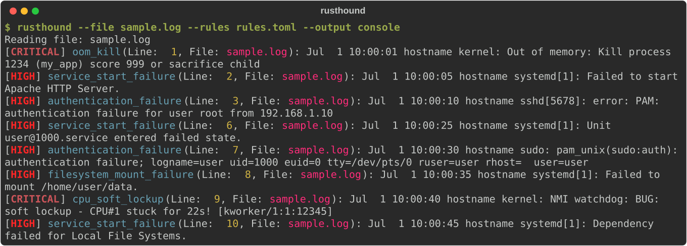

# RustHound

RustHound reads log files and reports lines that match rules or unusual activity.

> [!NOTE]
> **Status:** Maintained, experimental CLI; pre-1.0 portfolio project.

- Reads individual log files or directories of `.log` files.
- Matches text and regular-expression rules from TOML configuration files.
- Detects bursts of repeated errors and configured event sequences as they are read (see [scope and limitations](#scope-and-limitations)).
- Prints results to the console or writes them as JSON.
- Follow mode tracks newly appended log lines while keeping analyzer state.

## Quick start

You need Git and Rust 1.85+ with Cargo ([rustup](https://rustup.rs/)). The first build downloads Cargo dependencies. Clone the repository, then run the included sample log with the included rules; no external log service or rule authoring is needed:

~~~bash
git clone https://github.com/rustfuture/RustHound.git
cd RustHound

cargo run --locked -- \
  --file sample.log \
  --rules rules.toml \
  --output console
~~~

The sample run emits eight detections with severity and source-line context. See [the project guide](docs/project-guide.md) for other options, installation, and rule setup.

The image is the unedited console output of the release binary on the bundled `sample.log` and `rules.toml`, wrapped at 110 columns.

## Architecture

RustHound loads TOML rules and prepares its text and regular-expression matcher at startup. It reads each log line and checks it against those rules. Frequency and event-sequence rules keep state as lines are read, including across follow-mode updates. It filters detections by the requested minimum severity and writes them to the console, JSON, or both. See [the module map and data flow](docs/architecture.md) for implementation details.

## Tests

CI runs these commands:

~~~bash
cargo fmt --check
cargo check --locked --all-targets
cargo clippy --locked --all-targets -- -D warnings
cargo test --locked
~~~

The tests cover rule matching, frequency tracking, event correlation, rule-file parsing, and JSON output.

## Scope and limitations

- Processes log lines sequentially; no throughput or memory benchmarks are claimed without a dedicated benchmark environment.
- Frequency and correlation windows are measured on the time RustHound reads each line, not on timestamps inside the log. They describe bursts in live or follow mode; scanning an existing file counts lines that were logged hours apart as if they arrived within the same window.
- Follow mode watches local files with the `notify` crate; it is not a distributed log aggregation service.
- Verified on macOS (local development) and Linux (CI matrix); Windows is currently unverified.
- No package is published to crates.io; source builds from the repository are the supported installation path.

## License

Licensed under the Apache License, Version 2.0. See [LICENSE](LICENSE) for details.
